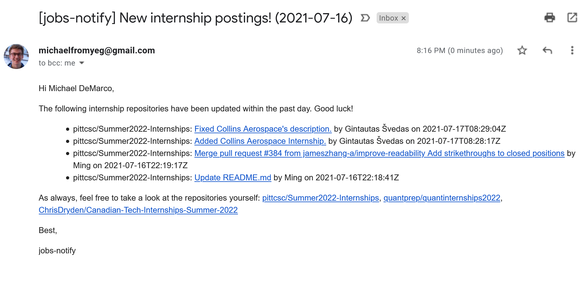

# jobs-notify ⚒️📬

**The latest software engineer internship postings, straight to your inbox.**

Get an email that contains a daily summary of new software engineer internships to apply to, sourced from [pittcsc/Summer2022-Internships](https://github.com/pittcsc/Summer2022-Internships), [quantprep/quantinternships2022](https://github.com/quantprep/quantinternships2022), and [ChrisDryden/Canadian-Tech-Internships-Summer-2022](https://github.com/ChrisDryden/Canadian-Tech-Internships-Summer-2022). (Thank you to all of the wonderful people who maintain those repositories; go give them each a deserved star!)

Inspired by [internship-notify](https://github.com/Bryce-MW/internship-notify/blob/main/notify.py).

<p align="center">
  
</p>

## Usage 🏃‍♂️

Install [Python](https://www.python.org/). Setup a virtual environment, such as `python -m venv env`. Make sure to activate your environment with `source env/bin/activate` (or the Windows equivalent, `./env/Scripts/Activate`).

Setup your environment variables in a `.env` file. If you'd like to use Gmail, you'll likely need an [app password](https://support.google.com/accounts/answer/185833?hl=en). For example,

```plaintext
FROM_EMAIL="anne_bob@gmail.com"
FROM_NAME="Anne Bob"

TO_EMAIL="anne_bob@gmail.com"
TO_NAME="Anne Bob"

MAIL_SERVER="smtp.gmail.com"
MAIL_PORT="465"
MAIL_USERNAME="anne_bob@gmail.com"
MAIL_PASSWORD="supersecret"
```

Run `pip install -r requirements.txt`.

Finally, do `python3 src/notify.py`.

A cool way to use this project is via a cronjob or Scheduled Task (i.e., cronjobs on Windows). See below for further instructions.

### Linux 🐧

We want to run `jobs-notify.sh` every 24 hours. The provided crontab file contains a configuration for doing so.

### Windows 🪟

The included `jobs-notify.bat` file should be run every 24 hours. This [blog post](https://www.jcchouinard.com/python-automation-using-task-scheduler/) will show you how to get that going.

## Notes 📝

### `.env`

To update the `.env.example` file, run

```shellscript
sed 's/=.*/=/' .env > .env.example
```

### AWS

> AWS Lambda can be scheduled to run at definite intervals. Generate the data (details for email) to be sent as JSON. Push the json into SQS. Use another AWS Lambda to read the SQS to send emails in batches.

Use [localstack](https://github.com/localstack/localstack) to test with `docker run --rm -it -p 4566:4566 -p 4571:4571 localstack/localstack` or simply `docker-compose up`.

To interact with AWS services, use the `--endpoint-url` with the AWS CLI with `localhost:4566`. For example, `aws --endpoint-url=http://localhost:4566 kinesis list-streams.`

If you get an error like "unable to locate credentials", run

```shellscript
$ aws configure --profile default
AWS Access Key ID [****************test]: test
AWS Secret Access Key [****************test]: test
Default region name [None]: us-west-2 # or any other region
Default output format [None]:
$ aws --endpoint-url=http://localhost:4566 kinesis list-streams
{
    "StreamNames": []
}
$ aws --endpoint-url=http://localhost:4566 lambda list-functions
{
    "Functions": []
}
```

Steps to create AWS resources:

```
$ aws --endpoint-url=http://localhost:4572 s3 mb s3://tutorial
$ aws --endpoint-url=http://localhost:4572 s3api put-object --bucket tutorial --key lambda
{
    "ETag": "\"d41d8cd98f00b204e9800998ecf8427e\""
}
$ aws --endpoint-url=http://localhost:4572 s3 cp ./test/files/ s3://tutorial/lambda/ --recursive
$ aws --endpoint-url=http://localhost:4576 sqs create-queue --queue-name lambda-tutorial
$ aws lambda create-function \
    --region ${REGION} \
    --function-name ${API_NAME} \
    --runtime nodejs8.10 \
    --handler lambda.apiHandler \
    --memory-size 128 \
    --zip-file fileb://api-handler.zip \
    --role arn:aws:iam::123456:role/irrelevant
```

## Next Steps ⏩

I'm looking to deploy this on AWS and make it a publicly available newsletter. I'm planning on using Lambda, SES, and SQS.

If this sounds of interest to you, please let me know!
